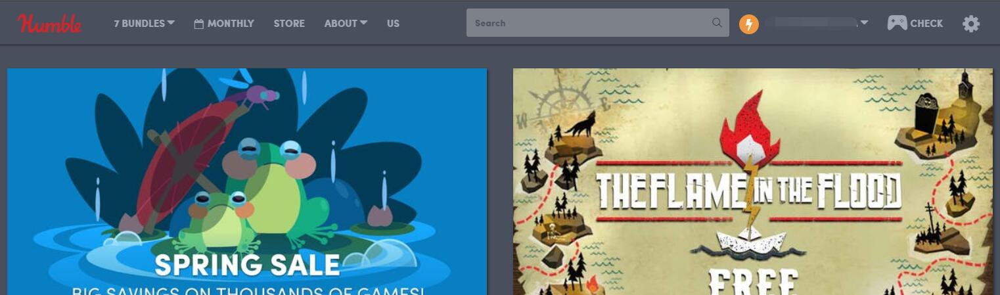
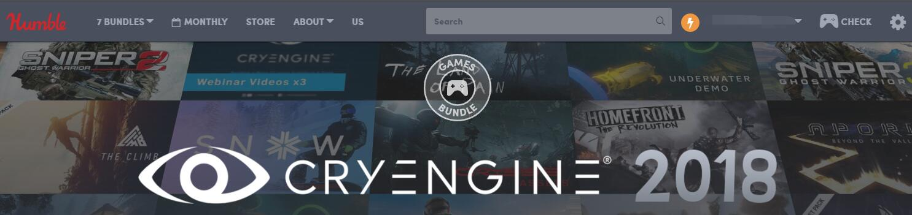
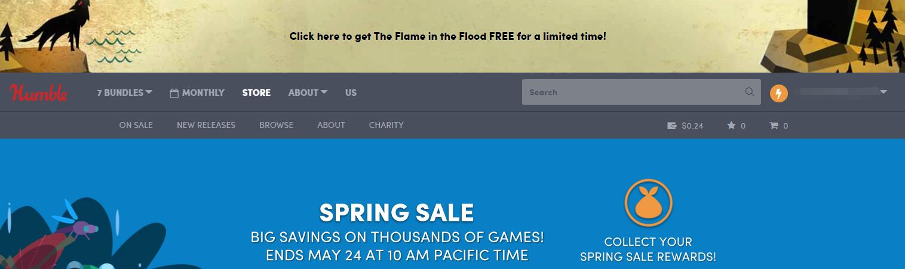
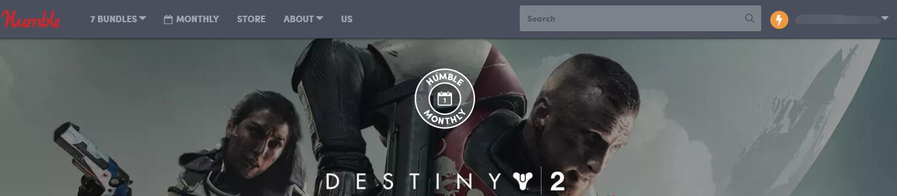

# Humble-Bundle-Current-Country-Spy

Show current Humble Bundle country in navbar.

## Install

1. Install [Greasemonkey](http://www.greasespot.net/) or [Tampermonkey](https://tampermonkey.net/), or other userscript manager.
1. [Click here](https://raw.githubusercontent.com/PixvIO/Humble-Bundle-Current-Country-Spy/master/HBCCS.user.js) and install this script.
1. Enjoy!

## It looks like

### Home

### Bundle

### Store

### Monthly

